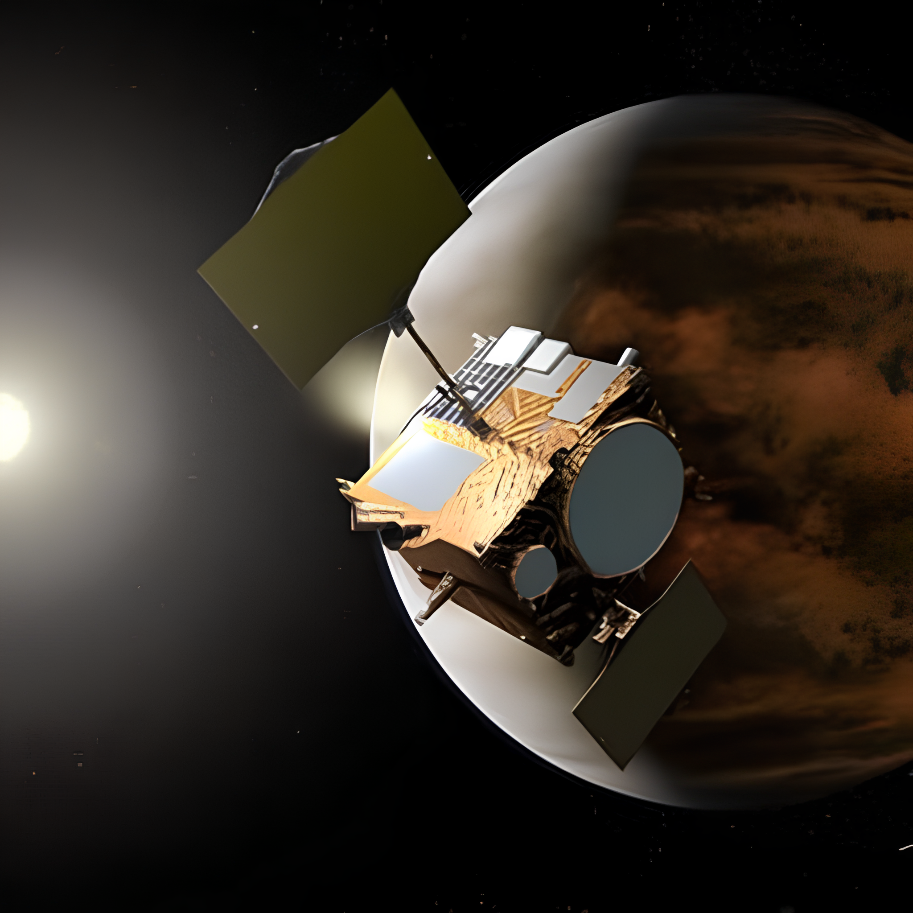

# Astronomy Image Classification

This project uses a deep learning model to classify astronomical images into 7 categories: asteroid, black hole, comet, galaxy, nebula, planet, and star.

## Classes

| asteroid | black hole | comet | galaxy | nebula | planet | star |
|----------|------------|-------|--------|--------|--------|------|
|  |  |  |  |  |  |  |

## Dataset

The dataset is sourced from [Kaggle: SpaceNet - An Optimally Distributed Astronomy Data](https://www.kaggle.com/datasets/razaimam45/spacenet-an-optimally-distributed-astronomy-data/data).

## Model Performance

The model achieves an overall accuracy of 89.16% on the test set. Detailed metrics per class:

| Class      | Accuracy | Precision | Recall | F1     |
|------------|----------|-----------|--------|--------|
| asteroid  | 83.33%  | 87.50%   | 83.33% | 85.37% |
| black hole| 81.82%  | 83.51%   | 81.82% | 82.65% |
| comet     | 87.30%  | 85.94%   | 87.30% | 86.61% |
| galaxy    | 95.15%  | 91.20%   | 95.15% | 93.13% |
| nebula    | 86.67%  | 90.70%   | 86.67% | 88.64% |
| planet    | 90.99%  | 96.19%   | 90.99% | 93.52% |
| star      | 83.41%  | 81.11%   | 83.41% | 82.24% |

## FastAPI Inference

The trained model is served via FastAPI for real-time predictions.

### Example 1

Input image: 

Command:
```
curl.exe -X POST "http://127.0.0.1:8000/predict" -F "file=@data\planet\planet_page_1_image_16_SwinIR_large.png"
```

Response:
```json
{"prediction":"planet","confidence":0.991813063621521}
```

### Example 2

Input image: 

Command:
```
curl.exe -X POST "http://127.0.0.1:8000/predict" -F "file=@data\nebula\nebula_page_1_image_2_2_SwinIR_large.png"
```

Response:
```json
{"prediction":"nebula","confidence":0.9892760515213013}
```

## Setup

1. Install dependencies: `pip install -r requirements.txt`
2. Run the API: `uvicorn api:app --reload`
3. Test with curl or Python requests.